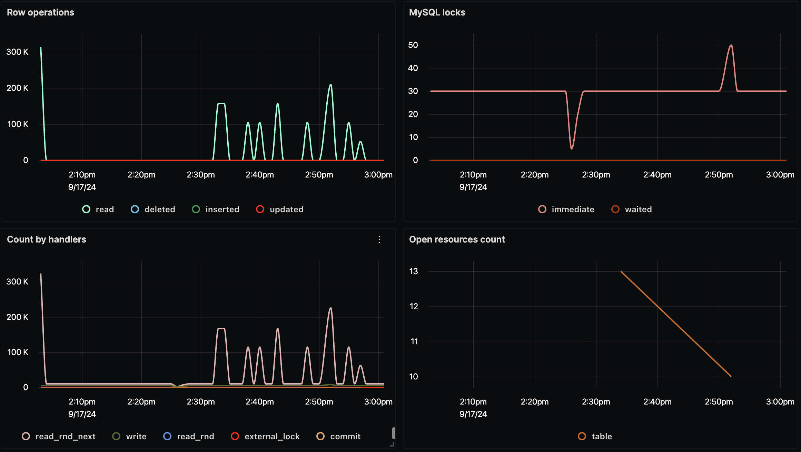
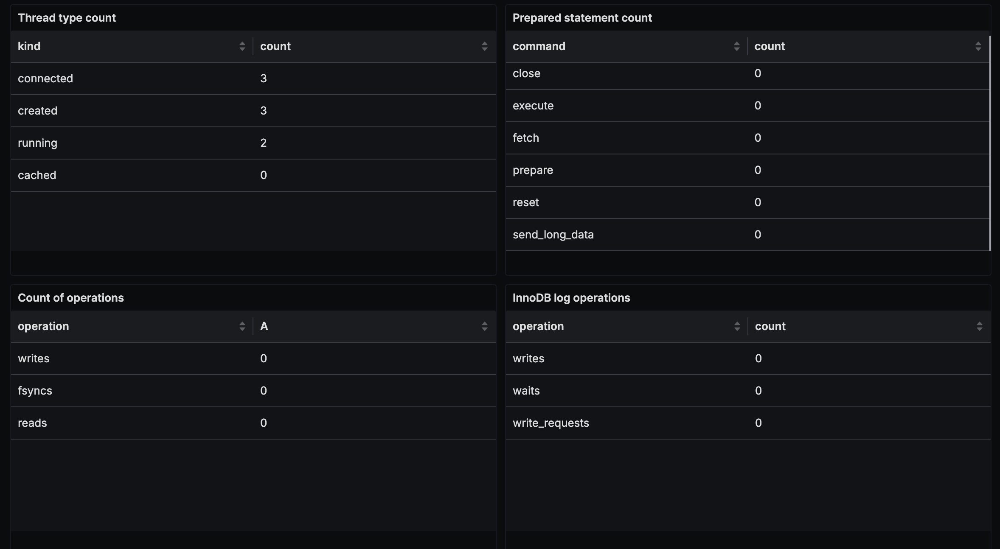
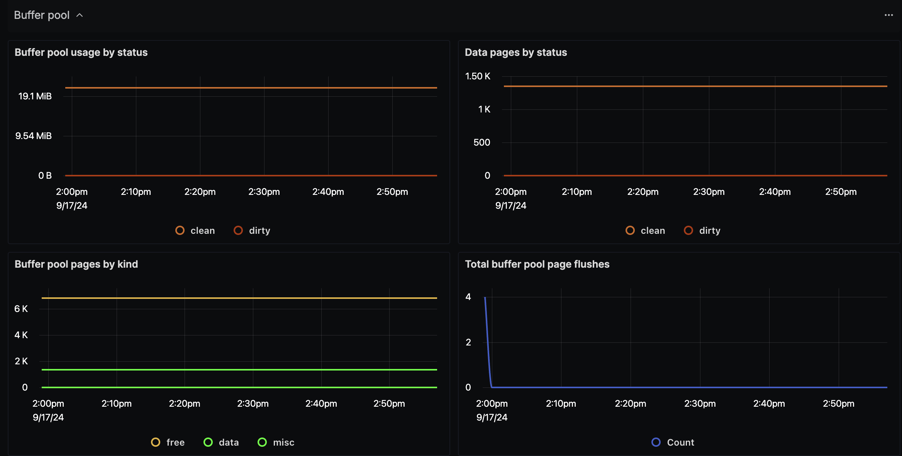

# MySQL Dashboard - OTLP

## Metrics Ingestion

### With OTLP MySQL Receiver

- Update `otel-config.yaml` with the following:

Add mysql receiver to the `receivers:` section:

```yaml
receivers:
  mysql:
    endpoint: localhost:3306
    username: <your-root-username>
    password: <your-root-password>
    collection_interval: 10s
    initial_delay: 10s
```

Add mysql receiver to the `pipelines:` section:

```yaml
service:
  pipelines:
    metrics:
      receivers: [mysql]
```

Below is sample `otel-config.yaml` file with two mysql instances:

```yaml
receivers:
  otlp:
    protocols:
      grpc:
        endpoint: localhost:4317
      http:
        endpoint: localhost:4318
  mysql:
    endpoint: mysqldb:3306
    username: root
    password: password123
    collection_interval: 10s
    initial_delay: 10s
  mysql/2:
    endpoint: some-remote-database-url:3306
    username: remote-username
    password: secret-password
    collection_interval: 10s
    initial_delay: 10s
processors:
  resource/env:
    attributes:
    - key: deployment.environment
      value: staging
      action: upsert
  batch:
    send_batch_size: 1000
    timeout: 10s
exporters:
  otlp:
    endpoint: "ingest.{region}.signoz.cloud:443" # replace {region} with your region if you are using signoz cloud, otherwise use localhost:4317 or wherever your collector is running
    tls:
      insecure: false
    headers:
      "signoz-access-token": "{signoz-token}" # Obtain from https://{your-signoz-url}/settings/ingestion-settings (signoz-token is only required for signoz cloud)
  logging:
    verbosity: detailed
service:
  telemetry:
    metrics:
      address: localhost:8888
  pipelines:
    metrics:
      receivers: [otlp, mysql, mysql/2]
      processors: [resource/env, batch]
      exporters: [otlp]
```

## Dashboard panels

## Variables

- `{{deployment_environment}}`: Deployment environment
- `{{mysql_instance_endpoint}}`: MySQL instance endpoint

### Sections

- Resources
  - Uptime - `mysql_uptime`
  - Connections/Errors - `mysql_connection_count` and `mysql_connection_errors`
  - Row Locks - `mysql_row_locks`
  - Row Operations - `mysql_row_operations`
  - SQL Locks - `mysql_locks`
  - Count by Handlers - `mysql_handlers`
  - Open Resources count - `mysql_opened_resources`
  - Thread type count - `mysql_threads`
  - Prepared Statement count - `mysql_prepared_statements`
  - Count of operations - `mysql_operations`
  - Innodb logs operations - `mysql_log_operations`
  - Screenshots of Resources Section -  
- Tables
  - Count of table I/O wait events - `mysql_table_io_wait_count`
  - Table I/O wait time - `mysql_table_io_wait_time`
  - Screenshot of Tables Section - 
- Buffer Pool
  - Buffer Pool usage by status - `mysql_buffer_pool_usage`
  - Data pages by status - `mysql_buffer_pool_data_pages`
  - Buffer pool pages by kind - `mysql_buffer_pool_pages`
  - Total buffer pool page flushes - `mysql_buffer_pool_page_flushes`
  - Screenshot of Buffer Pool Section - 
